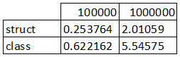
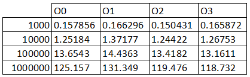

# Objektinio programavimo kurso 2-oji užduotis

## Užduotis

[1-osios užduoties](https://github.com/JovitaBu/OOP.-1-uzduotis) pratęsimas/tobulinimas.

## Įdiegimo istrukcija

- Parsisiųskite naujausią versiją.
- Naudojantis *CMakeLists.txt* sukompiliuokite ir paleiskite programą.

## Naudojimosi instrukcija

- Paleiskite programą ir sekite nurodymus. Jums bus pateikiami pasirinkimai, kuriuos reikės įvesti klaviatūra.

## v1.5 (12-21)

- Sukurta abstrakčioji *base* klasė *Person*, iš jos išvedama klasė *Student*.

## v1.2 (12-07)

- Realizuota *Rule of three*: sukurtas destruktorius, kopijavimo konstruktorius, kopijavimo priskirties operatorius.
- Pridėtas išvedimo operatorius. T.y.
```cpp
cout << student; 
```
išveda duomenis, kuriuos turi kiekvienas klasės *Student* tipo narys:
```
Vardas: vardas
Pavarde: pavarde
Namu darbai: 1 2 3 4 5
Egzaminas: 7
```

## v1.1 (12-07)

- Iš struktūros pereita į klasę.
- Funkcijos iš *final* ir *comparator* perkeltos į klasės failą, nes dirba su klasės nariais.
- Funkcijos iš *reading* ir *createFiles* perkeltos į naują failą *workWithFiles*.
- Funkcijos iš *output* perkeltos į *workWithScreen*. Pastarajame faile pridėta ir funkcija, kurioje nuskaitomi/generuojami studentų duomenys, kai juos veda vartotojas. Funkcija pritaikoma *main*'e, todėl sumažėja kodo pasikartojimo.
- Programa gali nuskaityti *kursiokai.txt* su iš anksto nežinomu namų darbų kiekiu.



Lentelė, iliustruojanti struktūros ir klasės veikimo spartą. Matome, kad klasės veikia 8-9 kartus lėčiau



Lentelė, iliustruojanti, kaip veikia kodas naudojant optimizavimo *flag*'us. Pastebima, kad *flag*'ai reikšmės turi tik, kai didelis duomenų kiekis (paskutinė eilutė).
