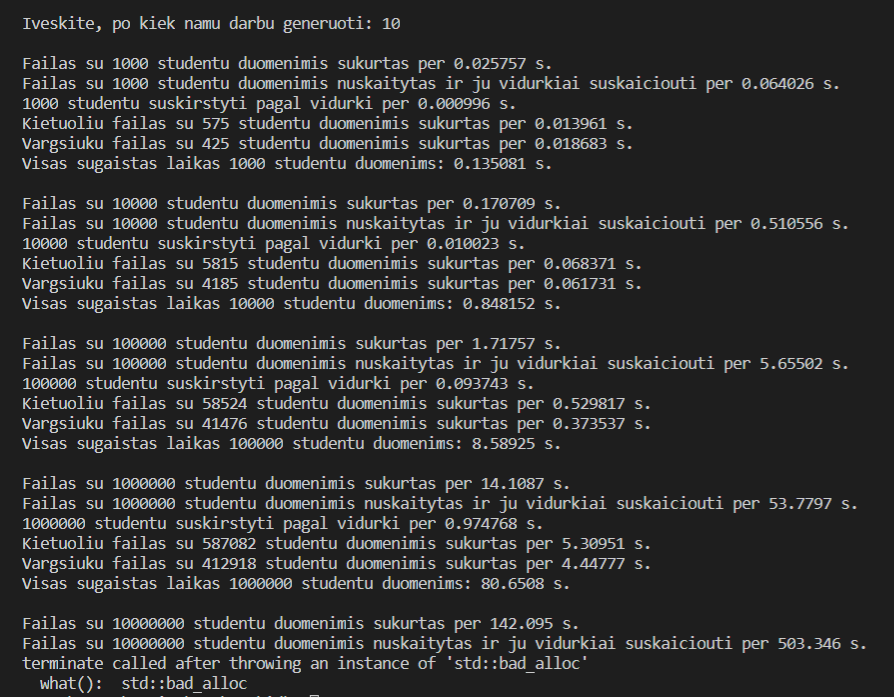
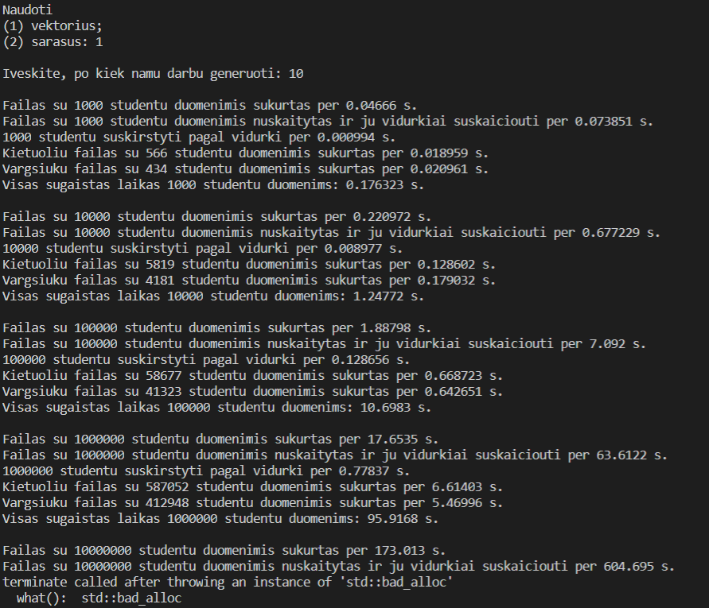
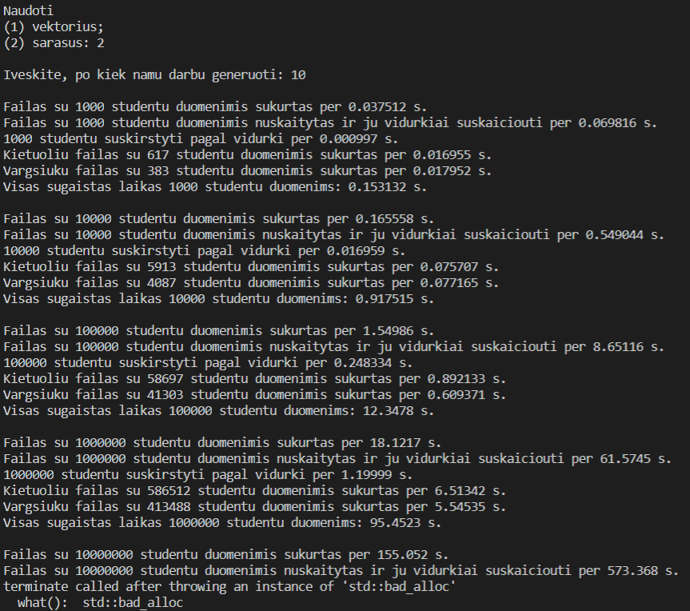
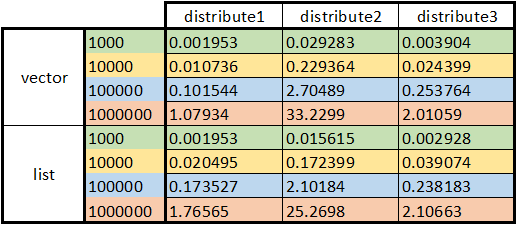

# Objektinio programavimo kurso 1-oji užduotis

## Užduotis

Sukurti programą, kuri nuskaito studentų vardus, pavardes, namų darbų pažymius ir egzamino įvertinimą bei suskačiuoja galutinį balą. Taikoma formulė GALUTINIS = 0,4×VIDURKIS + 0,6×EGZAMINAS. 

## v0.1 (09-27)

- Nuskaitomi duomenys (vardas, pavardė, egzamino įvertinimas, namų darbai).
- Galutinis balas skaičiuojamas pasirinktinai pagal namų darbų vidurkį arba medianą.
- Įvedant duomenis nebūtina žinoti namų darbų kiekio, tačiau negali viršyti 20 (įprastai semestre tiek nebūna).
- Galimybė namų darbus ir egzaminus generuoti atsitiktinai.
- Du *.cpp* failai: vienas su masyvais, kitas su vektoriais (bus naudojamas tolimesniam kūrimui).

## v0.2 (09-27)

**Nauja**
- Pasirinkimas skaityti duomenis iš failo kursiokai.txt (5 namų darbai).
- Kai duomenys nuskaitomi iš failo, rezultatai išvedami surikiuotų studentų vardų (ir pavardžių) tvarka.
- Kai duomenys nuskaitomi iš failo, rezultatuose išvedami galutiniai pažymiai ir pagal namų darbų vidurkį, ir pagal medianą.

**Koreguota**
- Pašalintos nereikalingos eilutės, paliktos per neapsižiūrėjimą (kintamas *sum* ir veiksmai su juo).
- Pakeista struktūra.
- Sukurta funkcija galutiniui pažymiui skaičiuoti.

## Pastaba. (10-15)
Sutvarkyta repozitorija. Koreguotos šakos, pakeisti failai, tačiau nekeistas jų turinys.

## v0.3 (10-15)

**Nauja**
- Funkcijos ir struktūra iškeltos į *header* failus.
- *Exception handling*. Įvedant duomenis (pasirinkimus, studentų skaičių, pažymius), tikrinama, ar reikšmė teisinga: pasirinkimai tik 1 arba 2, studentų skaičius didesnis nei 1, pažymiai intervale 0-10 (0 paliekamas kaip pasirinkimas, kai yra neatsiskaita).

**Koreguota**
- Keista struktūra; kintamasis *homework* iš masyvo pakeistas į vektorių.
- Namų darbų įvedimas - baigus užtenka paspausti *enter*.
- Funkcijoje *findMedian* pakeistas rūšiavimas.
- Funkcijos *countMean* ir *findMedian* pakeistos į atitinkamai *finalByMean* ir *finalByMedian*, jose iškart skaičiuojami galutiniai pažymiai, o ne namų darbų vidurkis ar mediana, todėl panaikinta ir ankstesnė galutinį pažymį skaičiuojanti funkcija.

**Galima keisti**
- Rezultatų išvedimo kodo dalį padaryti atskiroje funkcijoje.
- Galbūt kaip nors optimizuoti pasirinkimus.
- Namų darbų įvedimas vis tiek lieka neidealus – netyčia paspaudus *enter* dar nepradėjus vesti namų darbų (įvedus tik egzaminą), neskaičiuojami vidurkiai, nes nėra dalies duomenų.
- Nuskaitymą iš failo pritaikyti bet kuriam turiniui. T.y. namų darbų kiekio nežinant iš anksto, o tik nuskaičius pirmąją failo eilutę.
- KOMENTUOTI programos kodą!

## v0.4 (10-18)

**Nauja**
- Programos pradžioje galima pasirinkti failų generavimą: jie sugeneruojami, nuskaitomi, studentai suskirstomi į dvi grupes: *kietuoliai*, kurių galutinis balas >= 5 ir *vargšiukai*, kurių galutinis < 5, grupės įrašomos į atskirus failus. Visų procesų metu skaičiuojamas laikas.

Laiko testavimas, gaunama *bad allocation* klaida, kai bandoma išskirstyti 10 mln. studentų
 

**Koreguota**
- Atsitiktiniai skaičiai generuojami naudojant *chrono*, nebe *rand()*.
- Galutiniui balui skaičiuoti pridėta funkcija *final*.
- Rezultatų išvedimui parašyta atskira funkcija.
- Programa gana smulkiai komentuojama.

**Galima keisti**
- Vis dar daug *if*'ų *if*'e ir pasikartojančio kodo.
- Visiškai nekeistas *kursiokai.txt* nuskaitymas.

## v0.5 (11-12)

**Nauja**
- Pridėta dalis, kurioje naudojamas sąrašas (list), kad galėtų būtų palyginta veikimo sparta. Atitinkamos funkcijos parašytos naudojant *function overloading* metodą (to paties pavadinimo funkcijos, tik su skirtingais parametrais).

Kadangi failų kūrimas užtruko ilgiau nei vykdant v0.4, tai pakartotas ir bandymas su vektoriais.




Tiek darbas su vektoriais, tiek su sąrašais, užtrunka panašų laiko tarpą (lyginant tik duomenų nuskaitymą ir studentų skirstymą). Vis dėlto optimaliai palyginti neįmanoma, nes abu kartus failų kūrimas trunka skirtingą laiką, o tai reiškia, kad galbūt tuo metu kompiuteris veikė lėčiau/greičiau. Pavyzdžiui, 10mln. studentų duomenų failų kūrimas skyrėsi net beveik 20 sekundžių.

**Koreguota**
- Optimizuota *checkStudentCount* funkcija *check.cpp* faile.
- Dėl naudojama kompiliatoriaus, *main.cpp* faile *include*'inami *.cpp*, o ne *.h* failai. Anksčiau kodas buvo keistas ir rašytas su *header* failais, tačiau galiausiai nuspręsta palikti su *.cpp*.

**Naudoto kompiuterio parametrai**
- CPU: Intel(R) Core(TM) i5-7200U CPU @ 2.50GHz 2.71GHz
- RAM: 8GB
- HDD: SSD

## v1.0 (11-29)

**Nauja**

Pratestuotos dar dvi strategijos studentams skirstyti:
1. Senoji strategija - iš konteinerio *student* sukant ciklą tikrinti kiekvieno studento pažymį ir atitinkamai įrašyti į *good* ar *bad* konteinerį.
```cpp
void distribute1(std::vector<Data> student, std::vector<Data> &good, std::vector<Data> &bad){

    good.reserve(student.size()/2);
    bad.reserve(student.size()/2);
    
    for (Data s : student){
        if (s.finalGradeMean < 5.00){
            bad.push_back(s);
        }
        else{
            good.push_back(s);
        }
    }
}

void distribute1(std::list<Data> student, std::list<Data> &good, std::list<Data> &bad){

    for (Data s : student){
        if (s.finalGradeMean < 5.00){
            bad.push_back(s);
        }
        else{
            good.push_back(s);
        }
    }
}
```

2. *student* surūšiuojama pagal pažymius didėjančia tvarka. Tada sukant ciklą imamas kiekvienas studentas iš eilės, jei pažymys < 5, jis įrašomas į *bad* konteinerį. Kai pasiekiamas studentas, kurio vidurkis >= 5, ciklas stabdomas ir įsimenamas paskutinis tikrintas studentas. Tai panaudojama iš *student* ištrinant visus elementus, kurie buvo įrašyti į *bad*. Rezultatas - panaudoti tik du konteineriai, tačiau sukeistas pradinis studentų eiliškumas.

```cpp
void distribute2(std::vector<Data> &student, std::vector<Data> &bad){

    bad.reserve(student.size()/2);
    int last = 0;

    sort(student.begin(), student.end(), [](Data firstStudent, Data secondStudent){ return firstStudent.finalGradeMean < secondStudent.finalGradeMean; });

    for (Data s : student){
        if (s.finalGradeMean < 5){
            bad.push_back(s);
            last++;
        }
        else{
           break; 
        }
    }
    student.erase(student.begin(), student.begin()+last);
}

void distribute2(std::list<Data> &student, std::list<Data> &bad){

    int last = 0;

    student.sort([](Data firstStudent, Data secondStudent){ return firstStudent.finalGradeMean < secondStudent.finalGradeMean; });

    for (Data s : student){
        if (s.finalGradeMean < 5){
            bad.push_back(s);
            last++;
        }
        else{
           break; 
        }
    }
    std::list<Data>::iterator it = student.begin();
    std::advance(it, last);
    student.erase(student.begin(), it);
}
```
3. Naudojama *std::copy_if* ir *std::remove_if*. Tokiu būdu panaudojami du konteineriai ir nepakeičiamas pradinis studentų eiliškumas.

```cpp
void distribute3(std::vector<Data> &student, std::vector<Data> &bad){

    bad.reserve(student.size()/2);

    std::copy_if(student.begin(), student.end(), std::back_inserter(bad), [](Data s){return s.finalGradeMean < 5;});
    student.erase(std::remove_if(student.begin(), student.end(), [](Data s){return s.finalGradeMean < 5;}), student.end());
}

void distribute3(std::list<Data> &student, std::list<Data> &bad){

    std::copy_if(student.begin(), student.end(), std::back_inserter(bad), [](Data s){return s.finalGradeMean < 5;});
    student.erase(std::remove_if(student.begin(), student.end(), [](Data s){return s.finalGradeMean < 5;}), student.end());
}
```



Pratestavus visas strategijas abiems konteinerių tipams ir keturiems skirtingiems dydžiams, rezultatai surašyti lentelėje aukščiau (laikas sekundėmis). Akivaizdu, kad antroji strategija nepasiteisina, pirmoji veikia greičiau nei trečioji, tačiau trečia reikalauja mažiau naudojamos atminties. Pastaroji ir paliekama galutiniame variante.
